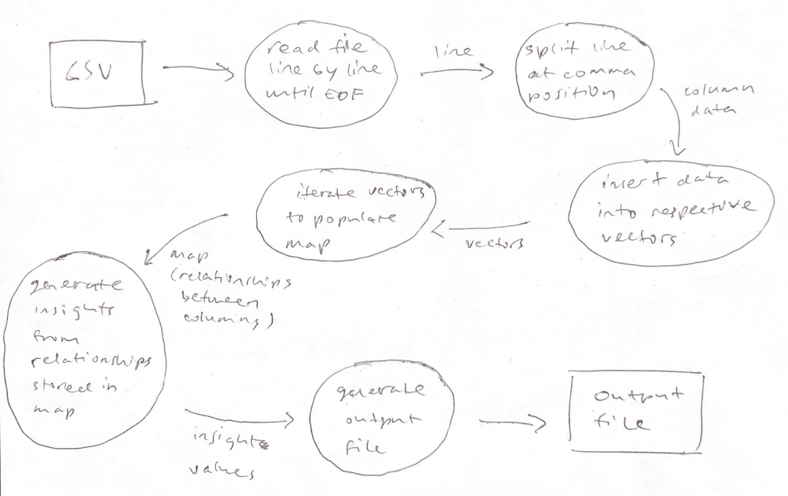

## Lab 1 Overview

In this lab, I was given a broken program that needs to read in values from a
CSV file and the task is to fix the program to ensure it is able to perform its
operation correctly.

#### Operations that the program needed to perform:

- read line by line from the csv file
- parse out values that are separated by commas
- insert values into its respective vectors
- iterate over vectors to populate map data structure to indicate relationships among two columns
- iterate map to extract insights (average brand & category price and year vs SKUs)
- generate output file

#### Data flow sketches



### Setup Instructions

1. Clone this repository and cd into project directory

```bash
git clone https://github.com/seanyap/cisc3142-coursework.git && cd lab1
```

2. Run Makefile to compile and build the project

```bash
make lab1
```

3. Run the executable program

```bash
./lab1
```

Delete object file

```bash
make clean
```
